# Práctica 1. Importar el archivo de AdventureWorks Sales 

En este primer ejercicio, se presenta el conjunto de datos que se utilizará a lo largo del curso. Con base en estos datos, se planea elaborar un reporte que represente el estatus de las ventas dentro de la empresa ficticia *AdvertureWorks*.

## Objetivo
Al finalizar la práctica, serás capaz de:
- Importar el archivo y hacer un análisis preliminar de cómo se conforman los datos y la calidad de los mismos.

## Duración aproximada

- 20 minutos.

## Objetivo visual

## Obtener los datos

Antes de crear el reporte, es necesario tener acceso a los datos para poder manipularlos.

Para ello, recuerda que la información puede provenir de distintos lugares: archivos locales, archivos remotos (en ubicaciones de la empresa o, bien, en internet), servicios especializados (Servicios de Microsoft, AWS, Google, entre un largo etcétera).

En ese sentido, para este primer laboratorio, usarás un archivo de Excel para obtener la información. El archivo se encuentra en la carpeta _Documentos_ de la máquina virtual. Lo identificarás como _**AdventureWorks Sales.xlsx**_.

Después de corroborar la presencia del archivo en el que trabajarás, es momento de abrir la aplicación de Power BI Desktop.

Una vez dentro de Power BI, comenzarás con una serie de tareas para obtener y analizar la información, por lo que tendrás que hacer las siguientes tareas.

### Tarea 1. Obtener la información

Recuerda cómo obtener la información dentro de Power BI y cuál es el tipo de dato que estamos usando en este ejemplo.

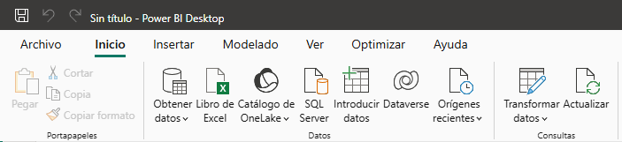

Al momento de obtener la información, ¿qué notas de raro con el conjunto de datos?  
Power BI analiza la información e identifica el contenido que podría ser necesario exportar. En este caso, hojas de cálculo, tablas, entre otros.

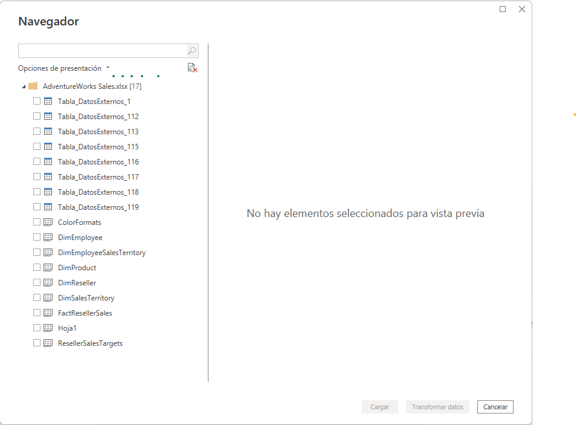

Si bien, tanto las tablas como las hojas tendrán básicamente el mismo contenido, existirán diferencias entre una opción y otra. Inspecciona estas diferencias. En este ejercicio, solamente seleccionarás las hojas de cálculo, pues serán usadas más adelante para modificar la información; en ese sentido, agrega las siguientes tablas:
- ColorFormats
- DimEmployee
- DimEmployeeSalesTerritory
- DimProduct
- DimReseller
- DimSalesTerritory
- FactResellerSales
- ResellerSalesTargets

### Tarea 2. Examinar los datos de cada consulta usando Power Query Editor

Al obtener este conjunto de datos, es necesario determinar su calidad, poder determinar qué elementos faltan y cuáles sobran o necesitan modificarse. Toma en consideración que estas actividades se harán en el siguiente laboratorio.

Dando una pequeña explicación de qué hace cada tabla y su contenido, se puede resumir lo siguiente. 
- La consulta **ColorFormats** tiene información que se utilizará para aplicar un formato condicional.  
- La tabla **DimEmployee** incluye los datos de todos los empleados de AdventureWorks. Para nuestro análisis, no necesitamos la información de personas ajenas al proceso de ventas.  
- El conjunto **DimEmployeeSalesTerritory** es el puente que permite correlacionar los datos del vendedor y de los territorios.  
- El contenido de la tabla **DimProduct**, como su nombre indica, describe las características del producto en distintos idiomas.  
- La consulta  **DimReseller** contiene la información de los distintos negocios que revenden nuestros productos.  
- La tabla **DimSalesTerritory** define en qué territorios tiene presencia nuestro negocio.  
- El conjunto **FactResellerSales** integra la información de las ventas que deseamos analizar.  
- El catálogo **ResellerSalesTargets** detalla los objetivos que cada vendedor debe lograr por mes.    

### Tarea 3. Examina los datos mediante las opciones de vista de Power Query para ver los datos estadísticos

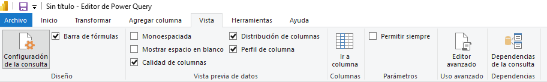

Si bien, esto lo cubrirás más adelante, puedes usar las opciones de la pestaña **Vista** y, en la sección **Vista previa de datos** puedes usar, por ejemplo, las opciones _Distribución de columnas_, _Perfil de columna_, _Calidad de columnas_. ¿Qué notas de los valores?, ¿qué valores notas atípicos?, ¿qué modificaciones harías?, ¿las columnas tienen el tipo de dato correcto?

De estas observaciones que has detectado, en el siguiente ejercicio harás algunas transformaciones en el conjunto de datos para dejar la información lista para utilizarse.

## Resultado esperado

Hasta este punto, deberás contar con ocho consultas cargadas en Power Query. Puedes corroborar dichas consultas y el contenido que deben contener con las siguientes imágenes de referencia.

### Resultado ColorFormats
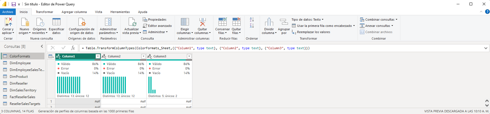
### Resultado DimEmployee
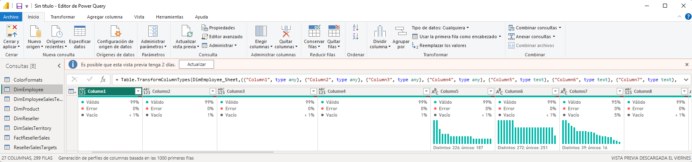
### Resultado DimEmployeeSalesTerritory
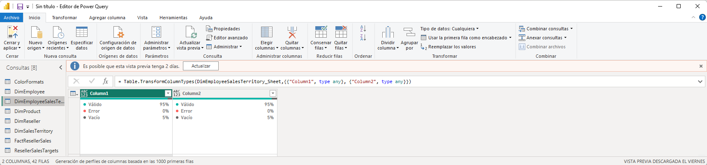
### Resultado DimProduct
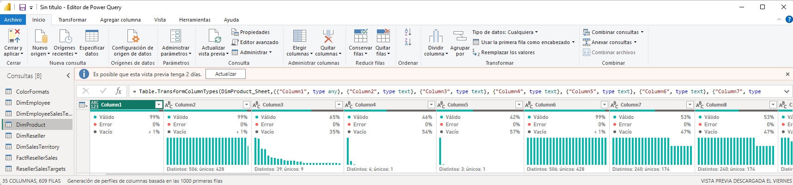
### Resultado DimReseller
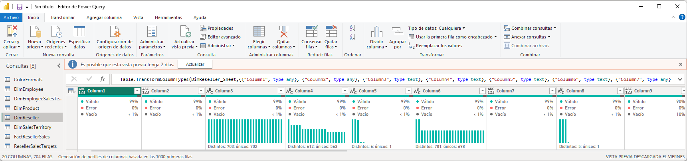
### Resultado DimSalesTerritory
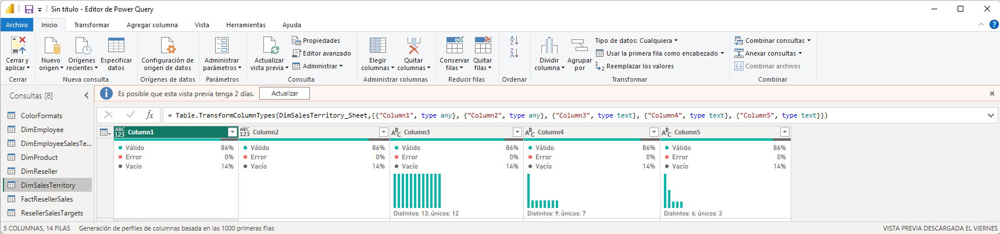
### Resultado FactResellerTargets
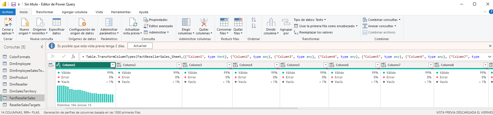
### Resultado ResellerSalesTargets
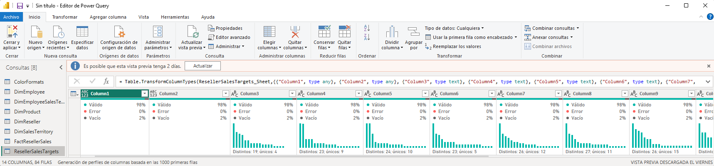
