# Práctica 2. Transformar el conjunto de datos de AdventureWorks 

## Planteamiento del ejercicio

En este segundo ejercicio, se retoma el archivo de Power BI que se ha creado anteriormente. A partir de este conjunto de datos y las observaciones realizadas, se requiere aplicar una serie de transformaciones con el fin de preparar la información para la elaboración del reporte de análisis de ventas.

## Objetivo
Repasar distintas transformaciones de datos y aplicar este conocimiento a distintas instancias de datos.

## Duración aproximada

Dependiendo de la experiencia previa que tengas en Power BI, la duración de estas actividades puede variar, pero el tiempo aproximado para analizar y realizar el laboratorio es de aproximadamente 60 minutos.

## Objetivo visual

## Transformar los datos

Recordemos que del ejercicio pasado, las consultas que se han seleccionado presentan una serie de inconvenientes que se deben corregir para trabajar los datos. Adicional a esto, no es necesaria toda la información que se acaba de seleccionar dentro de Power BI, por lo que para optimizar el proceso se tendrán que eliminar algunos datos irrelevantes para este análisis. 

Entre algunas de las transformaciones comunes que puedes observar de las distintas consultas se encuentran:  
- Borrar filas vacías.  
- Promover los encabezados correctos para las tablas. 
- Cambiar el nombre a las consultas.
- Seleccionar las columnas a eliminar o mantener.

### Tarea 1. Renombrar las consultas
En este paso, cambiarás el nombre de las consultas. Algunas de ellas manejan la terminología de Dim o Fact. Si bien, esta terminología no es muy compleja de entender, para algunas personas que no son propiamente analistas de datos, les puede resultar poco claro su significado, por lo que se ha decidido homologar la terminología de la siguiente de manera.

- ColorFormats (no es necesario cambiar nada)
- DimEmployee pasará a llamarse **Salesperson**
- DimEmployeeSalesTerritory cambiará a **SalespersonRegion**
- DimProduct se renombrará como **Product**
- DimReseller se renombrará a **Reseller**
- DimSalesTerritory lo sustituiremos por **Region**
- FactResellerSales ahora lo nombrarás **Sales**
- ResellerSalesTargets ahora sencillamente será **Targets**

    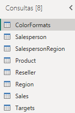

### Tarea 2. Transformar las consultas
* __Consulta ColorFormats__ 
  
    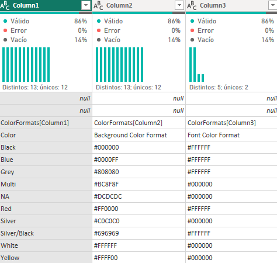

Recordando las observaciones que lograste detectar del ejercicio pasado, ahora realizarás las transformaciones necesarias para dejar los datos listos. En ese sentido y con el fin de homologar los pasos para transformar los datos, se enlistan las acciones a realizar.
- Hay dos filas vacías que se deben eliminar.
- Hay dos filas que parecen ser potenciales nombres de encabezados de columna; en ese sentido, los encabezados que deseamos para la columnas son: **Color**, **Background Color Format**, **Font Color Format**, por lo que la otra fila se puede eliminar.
  
    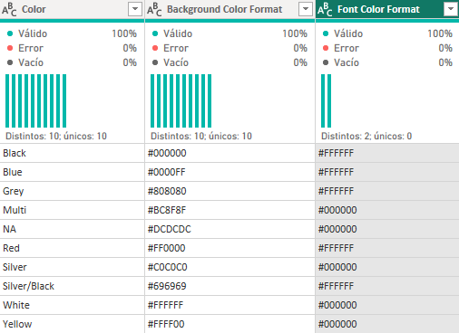

---

__Consulta Salesperson__

Esta es una consulta con más contenido y más cargada de columnas, por lo que necesitamos acotar cuáles son las columnas que necesitamos mantener, por lo que uno de estos pasos será promover los encabezados y, posteriormente, seleccionar qué columnas mantener.
- Hay dos filas con valores vacíos que son innecesarias, por lo que hay que cambiarlas.
- La fila que contiene, potencialmente, los valores que queremos usar como encabezados de columna tiene nombres con información repetitiva (DimEmployee[]) por lo que es necesario reemplazar esos datos. Pero antes de cambiarlos, primero vas a promoverlos como encabezado y, posteriormente, seleccionarás solo algunas columnas para reducir la cantidad de cambios a realizar. Mantén solamente las siguientes columnas y cámbiales el nombre para mantener solamente el texto entre corchetes:
    * DimEmployee[EmployeeKey]
    * DimEmployee[EmployeeNationalIDAlternateKey]
    * DimEmployee[FirstName]
    * DimEmployee[LastName]
    * DimEmployee[Title]
    * DimEmployee[EmailAddress]

Se pide combinar las columnas FirstName y LastName en una sola, combínala y nómbrala Sales Person.
Para simplificar la lectura, se pide renombrarla columna EmployeeNationalIDAlternateKey por EmployeeID.
Se pide, por último, cambiar la columna EmailAddress por UPN.

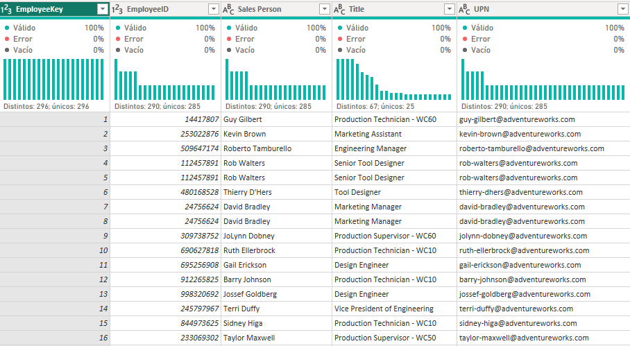     

---

__Consulta SalespersonRegion__  

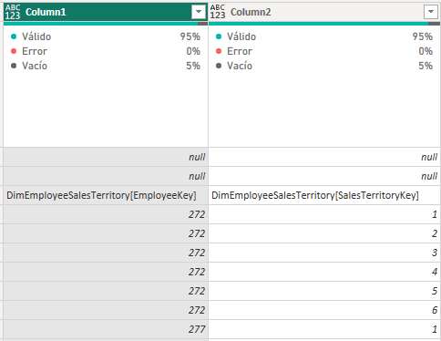

Solamente tienes que quitar las filas en blanco y promover los encabezados, cambiando el nombre para quitar el texto que no sirve.  

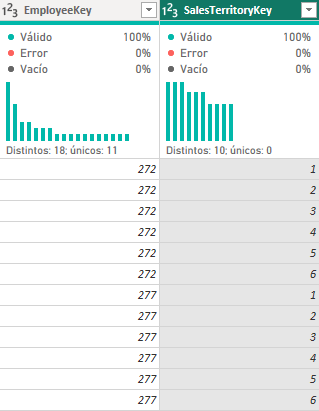

---

__Consulta Product__

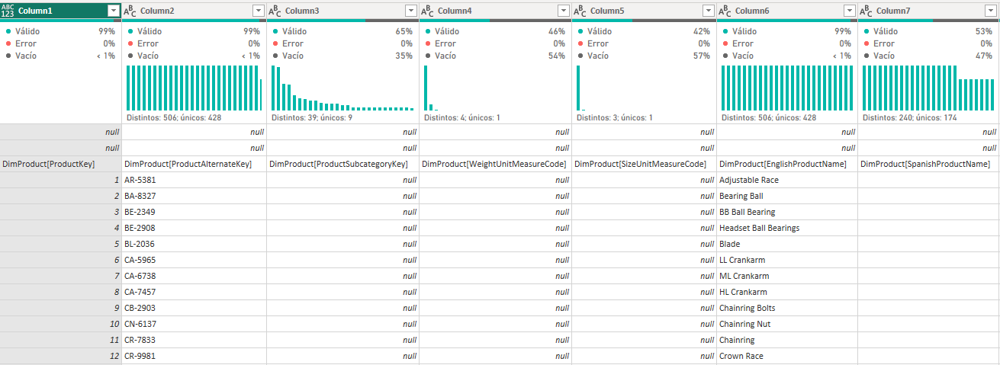

Esta es una consulta con más contenido y carga de columnas, por lo que necesitas acotar qué columnas mantener, así que uno de estos pasos será promover los encabezados y, posteriormente, seleccionar qué columnas mantener.
- Hay dos filas con valores vacíos que son innecesarias, por lo que hay que eliminarlas.
- La fila que potencialmente tiene los valores que queremos usar como encabezados de columna, notamos que tiene nombres con información repetitiva (DimProduct[]) por lo que es necesario reemplazar esos datos. Pero antes de cambiarlos, primero vamos a promoverlos como encabezado y, posteriormente, seleccionaremos solo algunas columnas para reducir la cantidad de cambios a realizar. Mantén solamente las siguientes columnas y cámbiales el nombre para mantener solamente el texto entre corchetes:
    * DimProduct[ProductKey]
    * DimProduct[EnglishProductName]
    * DimProduct[StandardCost]
    * DimProduct[FinishedGoodsFlag]
    * DimProduct[Color]
- Filtra el contenido de la columna FinishedCoodsFlag para mostrar solamente los productos terminados.
- Renombra la columna EnglishProductName a Product

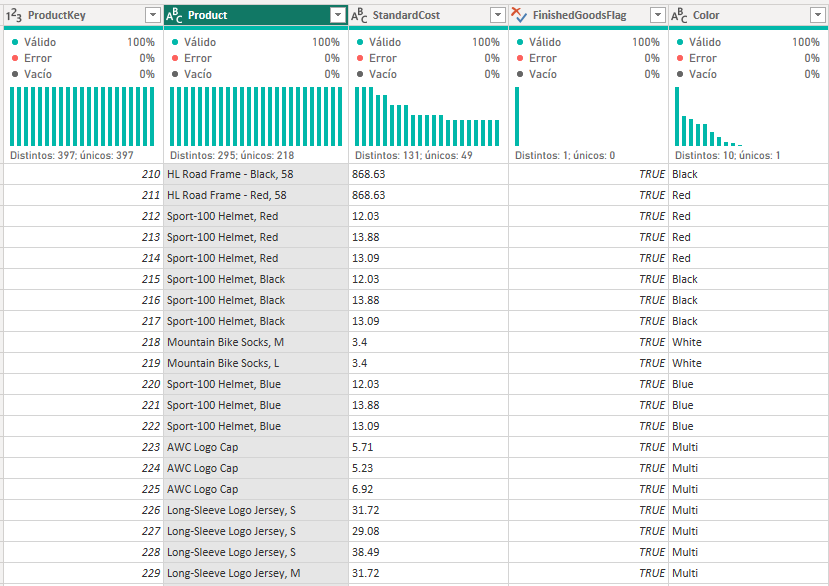

---

__Consulta Reseller__

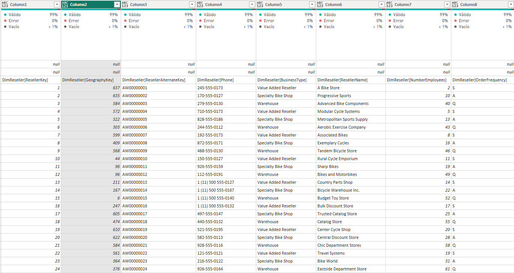
Esta es una consulta con mas contenido y mas cargada de columnas, por lo que necesitamos acotar cuales son las columnas que necesitamos mantener, por lo que uno de estos pasos será promover los encabezados y, posteriormente, seleccionar que columnas mantener.
- Hay dos filas con valores vacíos que no son necesarias, por lo que hay que eliminarlas.
- La fila que potencialmente tiene los valores que queremos usar como encabezados de columna, notamos que tiene nombres con información repetitiva (DimReseller[]) por lo que es necesario reemplazar esos datos. Pero antes de cambiarlos, primero vamos a promoverlos como encabezado y, posteriormente, seleccionaremos solo algunas columnas para reducir la cantidad de cambios a realizar. Mantén solamente las siguientes columnas y cámbiales el nombre para mantener solamente el texto entre corchetes:
    * DimReseller[ResellerKey]
    * DimReseller[BusinessType]
    * DimReseller[ResellerName]
Recuerda que en esta tabla, los valores que se presentaban en la columna _BussinessType_ tenían inconsistencia en la terminología, por lo que debes homologar los valores para _Warehouse_ y _Ware House_ de una sola manera.
    
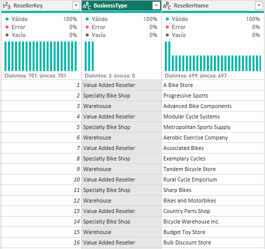

---

__Consulta Region__

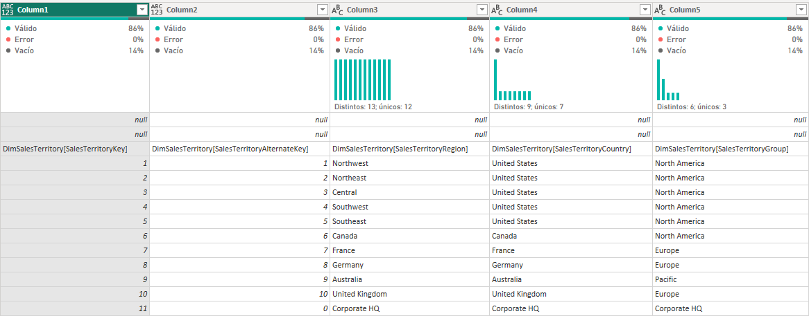

* Solamente debes quitar las filas en blanco y promover los encabezados, cambiando el nombre para quitar el texto que no sirve.
* Adicionalmente, considera que la columna _SalesTerritoryAlternateKey_ al no utilizarse y ser redundante con la columna _SalesTerritoryKey_ puede removerse para dejar solo 1.

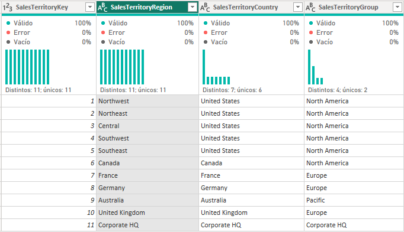

---

__Consulta Sales__

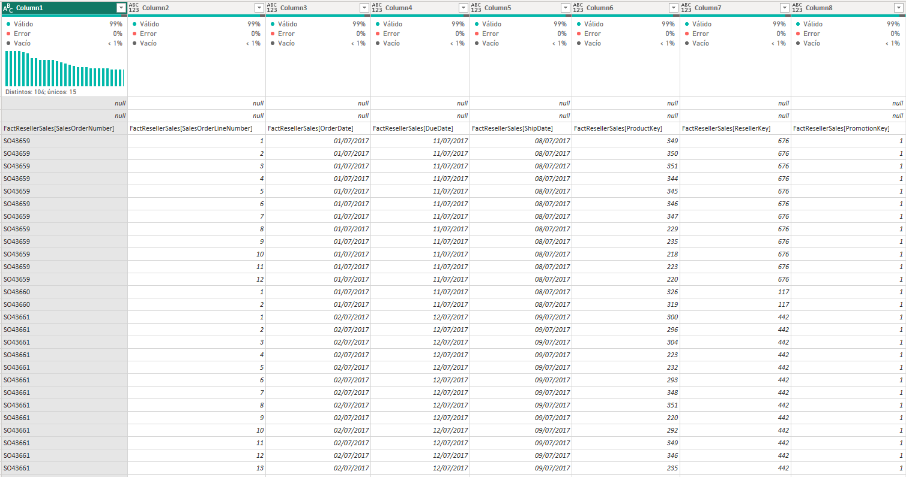

Esta es la consulta con más contenido de todas las que has visto hasta el momento, aunque no necesariamente la más cargada de columnas. Independientemente de eso, necesitas acotar cuáles columnas mantener, por lo que uno de estos pasos será promover los encabezados y, posteriormente, seleccionar qué columnas mantener.
- Hay dos filas innecesarias con valores vacíos, por lo que hay que eliminarlas.
- La fila que contiene,  potencialmente, los valores que queremos usar como encabezados de columna, tiene nombres con información repetitiva (FactResellerSales[]) por lo que es necesario reemplazar esos datos. Pero antes de cambiarlos, vas a promoverlos como encabezado y, posteriormente, seleccionaremos solo algunas columnas para reducir la cantidad de cambios a realizar. Mantén solamente las siguientes columnas y cámbiales el nombre para mantener solamente el texto entre corchetes:
    * FactResellerSales[SalesOrderNumber]
    * FactResellerSales[OrderDate]
    * FactResellerSales[ProductKey]
    * FactResellerSales[ResellerKey]
    * FactResellerSales[EmployeeKey]
    * FactResellerSales[SalesTerritoryKey]
    * FactResellerSales[OrderQuantity]
    * FactResellerSales[UnitPrice]
    * FactResellerSales[TotalProductCost]
    * FactResellerSales[SalesAmount]
Nos piden marcar las tres columnas que indican el precio unitario, el costo del producto y la cantidad de ventas como valores del tipo decimal fijo.

---

__Consulta Targets__

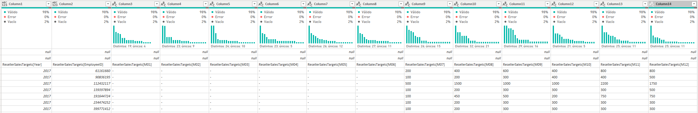

Puedes observar que esta consulta tiene una estructura de datos poco óptima para nuestro análisis, por lo que primero es necesario promover los encabezados de forma correcta para después hacer las correcciones necesarias en la estructura.
- Hay dos filas innecesarias con valores vacíos, por lo que hay que eliminarlas.
- Se busca anular la dinamización de las columnas de M01 a M12 manteniendo las otras como están.
- A las nuevas columnas generadas nombrálas _MonthNumber_ y _Target_ respectivamente.
- Cambia los nombres de las columnas ResellerSalesTarget[Year] y ResellerSalesTarget[EmployeeID] a _Year_ y _ExployeeID_ respectivamente.
- De la columna MonthNumber, extrae el texto para que solamente quede MXX.
- Posteriormente, en la misma columna, reemplaza el valor M para que solamente queden los números XX. Aprovecha y cambia el tipo de dato a un número entero.
- Filtra la columna Target para remover los valores vacíos (-).
- Añade una nueva columna a partir de ejemplos utilizando las columnas Year y MonthNumber
- Esta nueva columna se llamará TargetMonth.
- Cambia los tipos de datos de las columnas que presenten alguna inconsistencia.
- Quita las columnas Year y MonthNumber
- Multiplica por 1000 los montos de la columna Target.

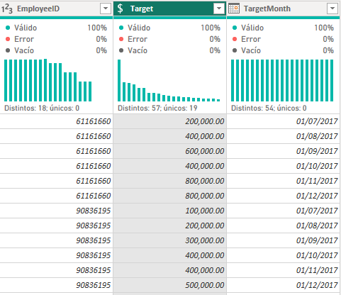
