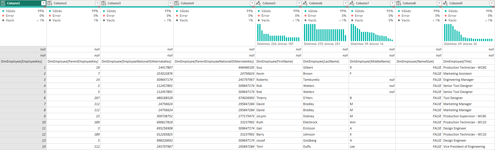
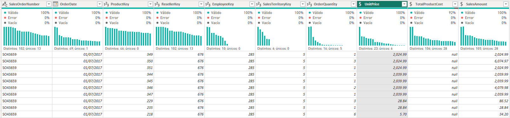

# Práctica 2. Transformar el conjunto de datos de AdventureWorks 

## Planteamiento del ejercicio

> En este segundo ejercicio se retoma el archivo de Power BI que se ha creado anteriormente, con base a este conjunto de datos y las observaciones que se han hecho sobre el mismo, se requiere hacer una serie de transformaciones para dejar las cosas listas para poder hacer el reporte de análisis de ventas.

## Objetivo

> Repasar distintas transformaciones de datos y aplicar este conocimiento a distintas instancias de datos.

## Duración aproximada

Dependiendo de la experiencia previa que tengas en Power BI, la duración de estas actividades puede variar, pero el tiempo aproximado para analizar y realizar el laboratorio es de aproximadamente 60 minutos.

## Objetivo visual

## Transformar los datos

Recordemos que del ejercicio pasado, las consultas que se han seleccionado presentan una serie de inconvenientes que es necesario corregirlos para poder trabajar la información, adicional a esto, no es necesaria toda la información que se acaba de seleccionar dentro de Power BI, por lo que para optimizar el procesar la información será necesario eliminar algunos datos que no nos interesa para este análisis. 

Entre algunas de las transformaciones que podemos observar que son comunes entre las distintas consultas se encuentran:  
Borrar filas vacías.  
Promover los encabezados correctos para las tablas. 
Cambiar el nombre a las consultas.
Seleccionar las columnas a eliminar y/o a mantener.
Entre otra serie de transformaciones.

1. Renombrar las consultas

> En este paso cambiaremos el nombre de las consultas, algunas de ellas manejan la terminología de Dim o Fact, si bien esta terminología no es muy compleja de entender para algunas personas que no son propiamente analistas de datos puede que les resulte poco claro que significa la misma, por lo que se ha decidido homologar la terminología de la siguiente de manera:

- ColorFormats (no es necesario cambiar nada)
- DimEmployee pasará a llamarse **Salesperson**
- DimEmployeeSalesTerritory cambiará a **SalespersonRegion**
- DimProduct lo renombraremos como **Product**
- DimReseller será renombrado a **Reseller**
- DimSalesTerritory que lo sustituiremos por **Region**
- FactResellerSales ahora lo nombraremos como **Sales**
- ResellerSalesTargets ahora sencillamente será **Targets**

    

2. Transformar las consultas

* Consulta ColorFormats: 
  
    

* Recordando las observaciones que lograste detectar del ejercicio pasado haremos ahora las transformaciones necesarias para dejar los datos listos, en ese sentido y para homologar los pasos para transformar los datos dejaremos una lista de acciones por realizar.
    * Hay 2 filas vacías por lo que es necesario eliminarlas.
    * Hay dos filas que parecen ser potenciales nombres de encabezados de columna, pero en ese sentido los encabezados que deseamos para la columnas son: **Color**, **Background Color Format**, **Font Color Format**. Por lo que la otra fila se puede eliminar.  
    

---

* Consulta Salesperson:

* Esta es una consulta con mas contenido y mas cargada de columnas, por lo que necesitamos acotar cuales son las columnas que necesitamos mantener, por lo que uno de estos pasos será promover los encabezados y, posteriormente, seleccionar que columnas mantener.
    * Hay dos filas con valores vacíos que no son necesarias, por lo que hay que cambiarlas.
    * La fila que potencialmente tiene los valores que queremos usar como encabezados de columna, notamos que tiene nombres con información repetitiva (DimEmployee[]) por lo que es necesario reemplazar esos datos. Pero antes de cambiarlos, primero vamos a promoverlos como encabezado y, posteriormente, seleccionaremos solo algunas columnas para reducir la cantidad de cambios a realizar. Mantén solamente las siguientes columnas y cámbiales el nombre para mantener solamente el texto entre corchetes:
        * DimEmployee[EmployeeKey]
        * DimEmployee[EmployeeNationalIDAlternateKey]
        * DimEmployee[FirstName]
        * DimEmployee[LastName]
        * DimEmployee[Title]
        * DimEmployee[EmailAddress]
     * Nos piden combinar las columnas FirstName y LastName en una sola, combinemosla y llamemosla como Sales Person.
     * Para simplificar la lectura nos piden renombrarla columna EmployeeNationalIDAlternateKey y cambiarla por EmployeeID.
     Nos piden por ultimo cambiar la columna EmailAddress por UPN.
     

---

* Consulta SalespersonRegion:  

* Solamente tenemos que quitar las filas en blanco y promover los encabezados, cambiando el nombre para quitar el texto que no nos sirve.  

---

* Consulta Product:

* Esta es una consulta con mas contenido y mas cargada de columnas, por lo que necesitamos acotar cuales son las columnas que necesitamos mantener, por lo que uno de estos pasos será promover los encabezados y, posteriormente, seleccionar que columnas mantener.
    * Hay dos filas con valores vacíos que no son necesarias, por lo que hay que eliminarlas.
    * La fila que potencialmente tiene los valores que queremos usar como encabezados de columna, notamos que tiene nombres con información repetitiva (DimProduct[]) por lo que es necesario reemplazar esos datos. Pero antes de cambiarlos, primero vamos a promoverlos como encabezado y, posteriormente, seleccionaremos solo algunas columnas para reducir la cantidad de cambios a realizar. Mantén solamente las siguientes columnas y cámbiales el nombre para mantener solamente el texto entre corchetes:
        * DimProduct[ProductKey]
        * DimProduct[EnglishProductName]
        * DimProduct[StandardCost]
        * DimProduct[FinishedGoodsFlag]
        * DimProduct[Color]
    * Filtra el contenido de la columna FinishedCoodsFlag para mostrar solamente los productos terminados.
    * Renombra la columna EnglishProductName a Product

---

* Consulta Reseller:

* Esta es una consulta con mas contenido y mas cargada de columnas, por lo que necesitamos acotar cuales son las columnas que necesitamos mantener, por lo que uno de estos pasos será promover los encabezados y, posteriormente, seleccionar que columnas mantener.
    * Hay dos filas con valores vacíos que no son necesarias, por lo que hay que eliminarlas.
    * La fila que potencialmente tiene los valores que queremos usar como encabezados de columna, notamos que tiene nombres con información repetitiva (DimReseller[]) por lo que es necesario reemplazar esos datos. Pero antes de cambiarlos, primero vamos a promoverlos como encabezado y, posteriormente, seleccionaremos solo algunas columnas para reducir la cantidad de cambios a realizar. Mantén solamente las siguientes columnas y cámbiales el nombre para mantener solamente el texto entre corchetes:
        * DimReseller[ResellerKey]
        * DimReseller[BusinessType]
        * DimReseller[ResellerName]
    * Recuerda que esta tabla, los valores que se presentaban en la columna BussinessType tenían inconsistencia en la terminología por lo que homologa los valores para Warehouse y Ware house de una sola manera.

---

* Consulta Region:

* Solamente tenemos que quitar las filas en blanco y promover los encabezados, cambiando el nombre para quitar el texto que no nos sirve.
* Adicionalmente considerar que la columna SalesTerritoryAlternateKey al no ser utilizada / ser redundante con la columna SalesTerritoryKey pues puede ser removida para rejar solo 1.

---

* Consulta Sales:

* Esta es una consulta con mas contenido de todas las que hemos visto hasta el momento aunque no necesariamente la mas cargada de columnas, pero independientemente de eso, necesitamos acotar cuales son las columnas que necesitamos mantener, por lo que uno de estos pasos será promover los encabezados y, posteriormente, seleccionar que columnas mantener.
    * Hay dos filas con valores vacíos que no son necesarias, por lo que hay que eliminarlas.
    * La fila que potencialmente tiene los valores que queremos usar como encabezados de columna, notamos que tiene nombres con información repetitiva (FactResellerSales[]) por lo que es necesario reemplazar esos datos. Pero antes de cambiarlos, primero vamos a promoverlos como encabezado y, posteriormente, seleccionaremos solo algunas columnas para reducir la cantidad de cambios a realizar. Mantén solamente las siguientes columnas y cámbiales el nombre para mantener solamente el texto entre corchetes:
        * FactResellerSales[SalesOrderNumber]
        * FactResellerSales[OrderDate]
        * FactResellerSales[ProductKey]
        * FactResellerSales[ResellerKey]
        * FactResellerSales[EmployeeKey]
        * FactResellerSales[SalesTerritoryKey]
        * FactResellerSales[OrderQuantity]
        * FactResellerSales[UnitPrice]
        * FactResellerSales[TotalProductCost]
        * FactResellerSales[SalesAmount]
    * Nos piden marcar las 3 columnas que indican el precio unitario, el costo del producto y la cantidad de ventas como valores del tipo decimal fijo.

---

* Consulta Targets:

* Esta es una consulta que podemos observar que tiene una estructura de datos poco optima para nuestro análisis, por lo que es necesario primero promover los encabezados de forma correcta para después hacer las correcciones necesarias en la estructura.
    * Hay dos filas con valores vacíos que no son necesarias, por lo que hay que eliminarlas.
    * Se busca anular la dinamización de las columnas de M01 a M12 manteniendo las otras como están.
    * A las nuevas columnas generadas nombralas como MonthNumber y Target respectivamente.
    * Cambia los nombres de las columnas ResellerSalesTarget[Year] y ResellerSalesTarget[EmployeeID] a solamente Year y ExployeeID respectivamente.
    * De la columna MonthNumber extrae e texto para que solamente quede MXX.
    * Posteriormente a la misma columna reemplaza el valor M para que solamente queden los números XX. Aprovecha y cambia el tipo de dato a numero entero.
    * Filtra la columna Target para remover los valores vacíos (-).
    * Añade una nueva columna a partir de ejemplos utilizando las columnas Year y MonthNumber
    * Esta nueva columna se llamará TargetMonth.
    * Cambia los tipos de datos de las columnas que presenten alguna inconsistencia.
    * Quita las columnas Year y MonthNumber
    * Multiplica por 1000 los montos de la columna Target.

